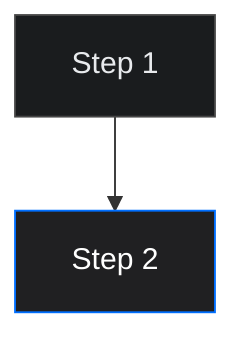

# Assistant guide

This file is for AI assistants (Claude, Cursor, Copilot, etc.) working on the Brimble docs. It captures the conventions, the hard rules, and the pitfalls that have already been worked through. Read it before making changes.

If you are a human reading this, the operational stuff for editors lives in `README.md`. This file is the *why* and the *how to not break things*.

---

## 1. What this repo is

The source for **Brimble's public documentation site**, built with [Mintlify](https://mintlify.com).

* Pages are `.mdx` files organized by feature area (`projects/`, `domains/`, `environments/`, etc.).
* Navigation, theming, fonts, and brand colors live in `docs.json` at the root.
* Run locally with `mintlify dev`.

The site is published from `main` after Mintlify validates `docs.json` and the MDX files.

---

## 2. The single hardest rule

**The codebase is the only source of truth.** Never document something based on what feels right, what other PaaS docs say, or what plausibly should be true. Verify against the relevant repo first.

Brimble services and where to look:

| Concern | Repo |
|---------|------|
| Project lifecycle, deployments, domains, env vars, autoscaling, webhook emission, sandbox API surface | `~/Documents/Archive/PERSONAL/work/core` |
| Build pipeline, builder, build cache | `~/Documents/Archive/PERSONAL/work/runner` |
| Database **and sandbox** provisioning, backups | `~/Documents/Archive/PERSONAL/work/heracle` |
| Edge proxy, request routing, password protection, MCP auth | `~/Documents/Archive/PERSONAL/work/proxy` |
| DNS service, Caddy config, CoreDNS Corefile | `~/Documents/Archive/PERSONAL/work/dns` |
| Subscriptions, Stripe, build minutes, refunds | `~/Documents/Archive/PERSONAL/work/brimble-payment` |
| Login, OAuth, 2FA, passkeys | `~/Documents/Archive/PERSONAL/work/auth-service` |
| Webhook delivery (factory + dispatch), email templates | `~/Documents/Archive/PERSONAL/work/brimble-email` |
| Dashboard UI, all settings panels, plan defaults, sandbox modals | `~/Documents/brimble/apps/dashboard/src` |
| Marketing site styling, tokens | `~/Documents/brimble/apps/web/src` |

If you are about to claim a behavior, search the relevant repo for a function, route, schema field, or config value that backs it up. If you can't find one, **say so explicitly** and either ask the user or write more conservatively. Do not split the difference with a confident-sounding guess.

When the user calls out a fabrication, fix it and look back at *adjacent* claims in the same doc. They were almost certainly produced by the same flawed inference.

---

## 3. Document only what users can do

The mongoose documents, RabbitMQ events, internal queues, and HashiCorp stack details are **not the public contract**. Public docs cover:

* What the user sees and does in the dashboard.
* Behaviors that the user observes from outside (URLs, headers, response codes, webhook payload shapes after the factory transforms them).
* The CLI and webhook configuration, anything users wire into their own systems.

Internal plumbing, infra components, and database schemas don't belong in public docs even when they're real. The smell test: would an engineer at a competitor learn something operational from this doc? If yes, cut it.

The webhook payloads are a good example: `core` emits the full `IProject` mongoose document, but `brimble-email/src/factory/webhook.factory.ts` reshapes it to a clean schema before delivery. The clean schema is what we document. The raw `IProject` with `vaultPath`, `vaultToken`, `tracking_token`, `nomadJobId`, etc. is not.

**Internal bookkeeping isn't user-valuable.** Lines like *"Persists a sandbox record with status: starting"*, *"Hands provisioning off to Heracle"*, *"Emits a sandbox:ready event"*, *"Marks the sandbox ready in MongoDB"*, *"Polls Nomad for the allocation"* belong in an engineering RFC, not a doc. Users can't act on internal sequencing; they care about what they observe. Rewrite as user-observable behavior:

| Internal bookkeeping (don't write) | User-observable behavior (write this) |
|---|---|
| "Persists a record with `status: starting`" | "The response comes back with `status: starting`." |
| "Marks the sandbox ready and emits a `sandbox:ready` event" | "The sandbox flips to `ready` and the API starts accepting runtime operations." |
| "Polls Nomad for the allocation" | "If the container doesn't come up within a few minutes, the sandbox is marked `failed`." |
| "Updates the record so the dashboard reflects the destroyed state" | "The sandbox's status becomes `destroyed`." |

If a sentence describes a write, a queue, a poll, an event emission, or a status update between internal components, it's almost certainly the wrong abstraction level for public docs.

---

## 4. Files and structure

```
docs.json                  Mintlify config: nav, theme, fonts, colors, navbar links, SEO
index.mdx                  Docs home page (cards grid)
README.md                  Human-facing repo readme (mintlify dev, conventions)
ASSISTANT.md               This file
style.css                  Custom CSS (orphaned, see §16)
fonts/                     ABC Marfa woff2 files (referenced from docs.json)
images/<area>/             Screenshots, organized by doc area
api-reference/             OpenAPI YAML specs (rendered as their own tab in the nav)

getting-started/           First-deploy flow
projects/                  Project lifecycle, builds, deployments, service types, scaling
mcp/                       Official Brimble MCP (overview, connect agents)
sandboxes/                 Brimble Sandboxes (overview, quickstart, snapshots, internals)
domains/                   Custom domains, buying, transfer, DNS
environments/              Environments, env vars, references
networking/                Edge, request lifecycle, internal services, rate limits
scaling/                   Scaling groups
observability/             Metrics, logs
analytics/                 Web analytics
workspaces-and-teams/      Workspaces, team management
security/                  2FA, passkeys
billing/                   Plans, build minutes
notifications/             Notification preferences
webhooks/                  Webhook setup + events reference
troubleshooting/           Symptom-indexed debugging
glossary.mdx               Term reference
```

The nav has **multiple tabs**: `docs.json` → `navigation.tabs[]` carries the **Documentation** tab (everything above) plus a **Sandbox API** tab driven by the OpenAPI spec at `api-reference/sandboxes.openapi.yaml`. Add new pages to the right area, then register them under the right `group` in the **Documentation** tab's `groups[]`. New API specs go in `api-reference/` and get their own tab entry.

---

## 5. Page conventions

**Frontmatter.** Every page has YAML frontmatter:

```yaml
---
title: "Page title"
description: "One-line summary, used as meta-description and previewed in search."
---
```

Mintlify renders the `title` as the H1, so **don't** write a duplicate `# Title` in the body.

**Internal links.** Use Mintlify's path-style links without the `.mdx` extension:

```mdx
See [Builds](/projects/builds) or [Plans and pricing](../billing/plans).
```

Both absolute (`/path`) and relative (`../area/page`) work. Drop `.mdx` either way.

**Headings.** Use `##` for top-level sections and `###` for subsections. The frontmatter `title` is the page H1; never start with `# ` in the body.

**Tone.** Direct, second person, active voice. Short sentences. No "simply," "just," "easily," "powerful," "seamless." Don't apologize for the product.

**Em-dashes are banned.** They make prose feel AI-generated. Use commas, periods, colons, or rewrite the sentence. Sweep them out before committing. Em-dashes inside fenced code blocks are fine.

---

## 6. Mintlify components

Use these instead of HTML or markdown image syntax.

**Callouts.** Available without imports: `<Info>`, `<Note>`, `<Tip>`, `<Warning>`, `<Check>`. They render as colored callout boxes:

```mdx
<Info>
  Database backups run every hour on the hour.
</Info>
```

**Image frames.** Use `<Frame>` with a single child ``, plus a one-sentence `caption`:

```mdx
<Frame caption="The Add Domain dialog with the CNAME record to copy.">
  
</Frame>
```

Image paths are absolute from the repo root. **Use `.jpg`, not `.png` or `.jpeg`.** Mintlify's CDN reliably serves `.jpg` and `.svg`; `.png` and `.jpeg` files in the repo are intermittently returning 404 on the deployed site, which renders as broken-image icons. When new screenshots land, convert with `sips -s format jpeg src.png --out src.jpg` and rename the reference. Don't hotlink external CDNs unless you're explicitly intentional (Simple Icons in `projects/frameworks.mdx` is the one exception).

**Diagrams: Mermaid, not ASCII.** ` ```text ` fences for ASCII flowcharts render with the full code-block chrome (drop shadow, copy button, right-edge gradient) and clip long lines on narrow viewports. Use ` ```mermaid ` blocks instead. They render natively, theme cleanly in dark mode, and don't clip. Pattern that themes well with our dark mode tokens:



**Image placeholders.** When a page references UI but no screenshot exists yet, use:

```mdx
<Info>
  **Image needed:** description of exactly what to capture, in enough detail that someone else can take the screenshot without asking.
</Info>
```

When the screenshot lands in `/images/`, swap the `<Info>` for a `<Frame>` block. The placeholder convention makes outstanding screenshots greppable: `grep -rn "Image needed:" .`.

**Cards.** For landing-style pages (the home `index.mdx`), use `<CardGroup>` with `<Card>` children:

```mdx
<CardGroup cols={3}>
  <Card title="Quickstart" href="/getting-started/quickstart">
    Deploy your first project in under 10 minutes.
  </Card>
</CardGroup>
```

**Steps, tabs, accordions.** Mintlify ships these too. See [Mintlify components](https://mintlify.com/docs/content/components) before reaching for HTML.

---

## 7. Code blocks

**Fences must be paired correctly:**

* The opener can carry a language tag: ` ```bash `, ` ```typescript `, ` ```text `.
* The closer must be **bare** ` ``` ` with no language. A closer with a tag (` ```bash ` at the bottom of a block) is *not* recognized as a closer; the parser keeps reading until it finds a bare fence, which collapses subsequent prose into one giant code block. This produces 404s in production and rendering chaos in preview. Always check that closers are bare.

**Tag every block.** Bare openers render without syntax highlighting. Use `text` for ASCII diagrams, DNS zone records, and other non-language content so they still get the code-block styling (border, copy button, monospace) without misleading colors.

Common tags by content:

| Content | Tag |
|---------|-----|
| Shell commands (`curl`, `dig`, `npm`, etc.) | `bash` |
| HTTP request/response | `http` |
| JSON | `json` |
| TypeScript or JS | `typescript` / `javascript` |
| YAML | `yaml` |
| `.npmrc`, `.env`, INI-style | `ini` (or `bash` for env-var assignments) |
| ASCII art, request flow, DNS records | `text` |

---

## 8. Two MDX gotchas you will hit

**HTML comments break the page.** MDX treats `<` as the start of JSX, so `<!-- ... -->` causes a parse error and the page returns 404. Use JSX comments instead:

```mdx
{/* this is a comment */}
```

**Curly braces in prose are JSX expressions.** `{{shared.NAME}}` outside a code span will be parsed by MDX as a JSX expression and fail. Always wrap brace-syntax env references in inline code:

```mdx
Reference a shared variable with `{{shared.NAME}}`.
```

The same applies to `{{@project-slug.NAME}}`. Inside fenced code blocks (` ``` ... ``` `) and inline code (`` `...` ``) braces are safe — MDX doesn't parse JSX inside code.

---

## 9. Hard editorial rules

* **No API endpoint references outside the webhook docs.** Don't write `curl https://api.brimble.io/v1/...` in any user guide. The webhook configuration page (and only that page) gets exceptions. For everything else, point at the dashboard.

* **No `<curl> | sh` install commands** unless the user explicitly asks.

* **No invented numbers.** If you don't have a value (rate limit, retry count, plan price), find it in the codebase or omit. The `core/src/services/v1/compute.service.ts` has the real metering math. `dashboard/src/utils/default-pricing.ts` has the real plan defaults. `brimble-payment/COMPUTE_PRICING_GUIDE.md` is internal but accurate.

* **No bullets that just describe what's not there.** "What's not shown" sections, "What you can't do" lists, defensive "the dashboard surfaces but you can't change in place" notes — fold the real point into the relevant section, drop the negation.

* **No "Verification" section just to add one.** A `curl -I https://your-app.brimble.app` and "you should see HTTP/2 200" doesn't help anyone. Keep Verification only when the verification step is non-obvious (the right `tools/list` JSON-RPC payload for an MCP server, the `wrk` invocation that actually exercises autoscaling, the `dig @1.1.1.1` for DNS troubleshooting).

* **No multi-language code triplets for trivial things.** Don't write the same `process.env.X` example in Node, Python, Ruby, and Go. Devs know how to read env vars in their language.

* **No worked-example math whiteboard for pricing.** The `(0.5 - 0.5) × $4 / 720h` style is alienating. State the rule, point at the dashboard view that shows the running cost, move on.

* **No fabricated "Discriminated union for handlers" / pattern-matching examples.** Webhook payload schemas are the doc; how the user dispatches on `event` is their business.

* **No competitor name-drops.** Don't reference Vercel, Railway, Render, Heroku, Fly, Cloudflare Workers, AWS, or any other PaaS by name in user-facing docs, even when comparing architectures. Use neutral framing like *"A common alternative is X"* and let the reader connect the dots. The build-system and sandbox-system deep-dives use this pattern explicitly.

* **No Kubernetes references.** Brimble runs on bare metal with the HashiCorp stack; positioning against K8s reads as defensive and dates badly. If you'd be tempted to write "without Kubernetes" or "instead of Kubernetes", drop the comparison entirely.

* **No troubleshooting items that are pure semantics or beyond user control.** Every troubleshooting bullet should be a concrete diagnostic plus a fix the user can run. "*'Add a payment method' → add a payment method*" is reading the error message back at the user. "*Region out of capacity*" is something the user can't act on. Cut both.

---

## 10. OPSEC

Public docs are reconnaissance fodder. The goal isn't to hide that Brimble uses Nomad / Consul / Vault / BuildKit / Cloudflare — those are fine to mention by name when the context calls for it. The goal is not to hand attackers a configuration map.

**Safe to mention.**

* Cloudflare sits in front of every request (the user can see this themselves from response headers).
* Brimble uses HashiCorp's stack, gVisor, BuildKit, Railpack at a high level.
* User-facing hostnames like `gateway.brimble.app`, `ns1.brimble.io`, `ns2.brimble.io`, the internal DNS suffix `*.service.brimble.internal` (which is what users wire into their own configs).
* Public response headers like `X-Brimble-Id`, `X-Brimble-Project-Version`.
* What the build does, what the runner does, what the cache does.

**Off-limits.**

* The names of third-party infrastructure providers Brimble runs on (referred to as "bare metal" or "Brimble's regions").
* Specific versions of any internal component.
* Internal config: ACL setup, sandbox/seccomp rules, network egress rules from builders, internal hostnames, default ports, ports on internal services, agent configs.
* Recovery, bootstrap, or admin procedures.
* Token, cookie, or session formats for internal auth between platform components.
* Internal API endpoints that aren't exposed to customers.
* How tenant isolation is enforced beyond "tenants are isolated."
* **Internal storage backends by name** (MongoDB, Redis, RabbitMQ, Ably, Loki). Say "the sandbox record", not "the Mongo document". Say "the dashboard updates", not "the Ably channel pushes an event".
* **Internal event names** (`sandbox:provision:failed`, `sandbox:ready`, `sandbox:expired`, anything that looks like `<service>:<noun>:<verb>`). Frame as status transitions the user can observe: "the sandbox flips to `ready`".
* **Internal queue / bus references**: "message bus", "RabbitMQ", "Bull queue", "Redis pub/sub". Users don't see these. Talk about the user-visible side effect.
* **Internal namespace / task / pool names**: Nomad job names (`sandbox-<id>`, `sbx`, `run`), node pool names, Consul namespace names. Say "scheduled on a sandbox host" without leaking the labels.
* **CNI / CSI plugin names**: `s3`, `geesefs`, the specific bridge/no-egress CNI plugin name. Say "CSI-backed persistent volume" or "outbound network blocked" without naming the implementation.
* **Specific defense mechanisms that map to attacker tools.** Don't write *"cloud-metadata endpoints at `169.254.169.254` are spoofed to localhost"*, that's a recipe for someone to test whether your mitigation is in place. Say *"the container can't reach the host's identity or credentials surface"*. Same idea: don't enumerate `cap_drop` lists, seccomp filters, or pid limits with their exact values.
* **Internal timing constants** (provision-poll timeout, stuck-starting threshold, reaper intervals). Say "a few minutes" or "hourly".

If a section requires an internal hostname, port, event name, or recovery sequence to be useful, it's an internal doc, not a public one.

---

## 11. Brand

Pulled from `apps/dashboard/src/styles.css` and `apps/web/src/styles.css` (identical tokens):

| Token | Light | Dark |
|-------|-------|------|
| Brand blue | `#006fff` | `#006fff` (unchanged) |
| Accent orange | `#f5a623` | `#f5a623` |
| Foreground | `#222528` | `#e8eaed` |
| Page background | `#fafafa` | `#1a1c1e` |

**Fonts** are **ABC Marfa** (body and headings) and **ABC Marfa Mono** (code), licensed from Dinamo. The variable `.woff2` files live in `/fonts/`. Trial cuts are wired today; production should use the licensed cuts when available. Mintlify only accepts `woff` / `woff2`, not TTF / OTF.

`docs.json` references the body font; the mono font isn't wired up yet.

---

## 12. Things that have already burned me

A running list. Add to it.

* **`_id` on the wire.** The webhook payload uses `id`, not `_id`. The dashboard backend strips Mongo's `_id` before sending. Don't expose `ObjectId` as a TypeScript type in docs; it's `string`.
* **Dashboard label vs runtime behavior.** The database overview card says "Backup frequency: Daily" but `heracle/internal/service/cron.go:42-43` cron is `0 0 * * * *` — every hour. The cron is the truth.
* **Hacker price.** $5/month, not $7. Pro is $15, not $19. Sourced from `dashboard/src/utils/default-pricing.ts` (the live config). Older internal docs have $7/$19; ignore them.
* **Plan free CPU/memory baseline.** Free is 0.25 vCPU / 0.25 GB. The compute slider's smallest stop is 0.5 — meaning Free-plan projects pick up metered overage as soon as they create a project. Document this honestly.
* **Persistent disk default.** 10 GB minimum, not 1. Sizes go 10–150 GB in 10 GB steps (`disk-size-options.ts`).
* **Password protection** uses a session cookie + form login (`x-brimble-session`), **not** HTTP Basic Auth. `curl -u user:pass` is wrong. There's no self-serve toggle in the dashboard yet.
* **MCP auth header** for projects with edge MCP auth is `x-brimble-key`. **Brimble MCP** (`https://mcp.brimble.io`) also accepts `Authorization: Bearer <api-key>` and maps it to `x-brimble-key` toward Core.
* **`subscription_id` in webhook envelope** is in the internal RabbitMQ payload, but `brimble-email/src/factory/webhook.factory.ts` strips it before sending to the user. The user-visible envelope is `{event, data}`.
* **Webhook signing.** Real events (factory → Hookdeck → user) are unsigned. The `X-Brimble-Webhook` HMAC and `X-Brimble-Test` header only apply to the one-off test endpoint, not production deliveries. Don't claim users should verify HMAC.
* **Env var values are not in webhook payloads.** Only the variable name (`envData.name`). The `data.value` field doesn't exist in the factory output.
* **Region defaults are read at runtime** from the `PlanConfiguration` Mongo collection, not hardcoded. The internal `COMPUTE_PRICING_GUIDE.md` documents the values; the dashboard's `default-pricing.ts` mirrors them as fallbacks.
* **Hugging Face git integration was removed.** Don't reintroduce it without confirmation.
* **Builder, not Runner.** The build worker is called the **Builder** everywhere user-facing. The codebase still uses "runner" in file names and class names, but the docs are renamed. Don't backslide.
* **Build pipeline step 7 is "Launch", not "Orchestrate".** That's the step where the artifact goes live on the Nomad cluster. Same applies in `projects/builds.mdx` and `projects/build-system.mdx`.
* **Free plan can only deploy static sites + 1 free-tier database.** `core/src/services/v1/verify-payment.service.ts:58-59` rejects every non-static project on Free at deploy time. So there's no path where a Free user picks a slider position that meters compute, don't write callouts about "quiet overage" on Free; it's impossible. Static sites have no compute allocation.
* **Free databases are deleted after 15 days, not paused.** `core/src/services/v1/database.service.ts` `reapExpiredFreeTierDatabases` calls `projectService.deleteProject(project)`. The dashboard's "paused" copy is softer than the reality.
* **Rate limiting is Cloudflare, not the proxy middleware.** The proxy has a `rate-limit.ts` middleware that defaults to "500 req / 10 min / IP / domain", but **it's not wired into the live request path**. Cloudflare handles it with adaptive rules. Don't quote the 500 number.
* **Platform API keys** authenticate Core, SDKs, and **Brimble MCP**. Keys can be scoped (permissions). See `mcp/overview` and `mcp/connect` for the hosted agent server; see `projects/deploy-an-mcp-server` for user-deployed MCP projects.
* **Apex A record IP is `157.90.225.125` at `@`.** Don't say "see the dashboard for the IP"; write the value, sourced from `dns/lb/keepalived-backup.conf`.
* **Workspace pricing: $5/seat + $8/build, min 2 builds.** Sourced from `dashboard/src/config/index.ts:36-37`. 3 seats + 2 builds = $31/mo. Don't write $7.50/build or 0/1 minimum builds.
* **Payment retry copy avoids Stripe by name.** The user-facing retry flow describes what users see (warnings, builds disabled at attempt 3, projects suspended when retries exhaust, canceled at 30 days unpaid). It doesn't mention Stripe, Smart Retries, or webhook event names. The internal payment service handles the "how"; the user only needs the "what".
* **Header strip + Header inject sections were removed** from `networking/request-lifecycle.mdx`. The numbered spine goes 1-10 now; don't reintroduce header-injection or header-strip explanations without confirmation.
* **Next.js / Nuxt SSR-vs-static gotcha.** A Next.js or Nuxt repo deployed as a static site (the only option on Free) needs explicit static-export config (`output: "export"` for Next, `nitro.preset: "static"` for Nuxt), otherwise the build emits SSR artifacts the static deploy can't serve, and the deployed site loads blank. Warning lives in `projects/service-types.mdx` Static site section.
* **Database backups are rolling latest, not retained.** `heracle/internal/service/storage.go:752-755` deletes prior snapshots before each upload, so only one snapshot per project per backup type survives. Hourly schedule from `BackupCronSchedule envDefault:"0 0 * * * *"`. Don't claim a multi-day retention window.

---

## 13. Workflow for adding or editing a page

1. Read the relevant codebase paths to ground the claims.
2. Write or edit the `.mdx` file.
3. If new, add it to `docs.json` under the right group.
4. Run `mintlify dev` and visually verify on `http://localhost:3000`. Check:
   * The page renders (no 404).
   * Code blocks have syntax highlighting where expected.
   * Internal links resolve.
   * No JSX parse errors in the terminal.
5. Sweep the file for em-dashes, fabrications, em-dash-y "Verification" sections, and HTML comments.
6. Commit. Reasonable message format:

```
Short summary (imperative, ≤72 chars)

Sourced from <repo>/<path>:<lines>.

- bullet of what changed
- bullet of what was removed
- bullet of any constraints (e.g. "kept ABC stays as <code> until UI ships")
```

---

## 14. When the user pushes back

Most edits in this repo come from a user pointing out something is wrong, missing, or over-explained. Default response:

1. **Look at the code first.** Before defending or extending what's there, search the codebase for the actual behavior. The user's instinct that something is wrong is usually right.
2. **Cut, don't decorate.** When in doubt, less is better. The user has repeatedly pulled out filler ("Verification" sections that just curl the URL, multi-language env-var examples, math-whiteboard pricing, "Why use X" sales sections, "Discriminated union" patterns). Those are high-likelihood removal candidates.
3. **Acknowledge the specific mistake.** Don't generalize. If the FAQ had six fabricated entries, name the six and what was wrong about each.
4. **Don't propose to keep "less sure about" items in the user's court while doing the rest unilaterally.** When the user says "go ahead," do all the cuts you flagged.

---

## 15. If you have to invent something to keep going

Don't. Stop and ask the user. The blast radius of a confident-sounding fabrication in docs is months of bad behavior in user code, support tickets, and trust erosion. Asking is cheaper than every alternative.

---

## 16. Mintlify config quirks

Hard-won and easy to re-trip on:

* **`background.color`, singular, not `colors`.** The schema field is `background.color.{light, dark}`. Writing `background.colors` fails validation with a misleading "Property colors is not allowed" error. Same shape as the `colors` block at the top of `docs.json` (which IS plural), so the inconsistency catches everyone.
* **No custom-CSS hook in the `mint` theme schema.** The `styling` block accepts `eyebrows` and `codeblocks` enums only, not a `css` path. A `style.css` at repo root will exist but Mintlify won't auto-load it on deploy (`https://<site>/style.css` returns 404). For now we don't have a working path for custom CSS; the orphaned `style.css` is intentional, kept around as a parking spot in case Mintlify ships a hook or we move to a different platform.
* **There are 9 themes.** `mint` (default), `maple`, `palm`, `willow`, `linden`, `almond`, `aspen`, `luma`, `sequoia`. Switching is a one-line `"theme": "..."` change in `docs.json`; the schema is identical across all 9 (zero theme-unique fields), so existing config keeps working.
* **OpenAPI tab integration.** Pass the spec path as a bare string at the tab level: `{ "tab": "Sandbox API", "openapi": "/api-reference/sandboxes.openapi.yaml" }`. Mintlify auto-generates one page per endpoint. The object form `{ source, directory }` is also valid but isn't required and the directory field doesn't change behavior here.
* **SEO block shape:** `seo.indexing: "all"` to index every page (default is `"navigable"`, which only indexes nav-listed pages). `seo.metatags` is an arbitrary key→value object that becomes `<meta>` tags on every page (OG, Twitter Card, robots, verification tokens).
* **`metadata.timestamp: true`** shows last-modified date at the bottom of every page. Useful for trust signals.
* **`contextual.options`** controls the **Copy page** dropdown. Valid values include `copy`, `view`, `chatgpt`, `claude`, `perplexity`, `grok`, `aistudio`, `devin`, `windsurf`, `cursor`, `vscode`, `mcp`, `add-mcp`, `devin-mcp`. We ship `["copy", "view", "chatgpt", "claude", "perplexity"]`.
* **Fonts: two slots, `heading` and `body`.** Only `heading` is currently wired to Marfa (weight 700). The body font falls back to Mintlify's default, which means bold runs in body copy also fall back to system bold. Wiring `body` to Marfa fixes the bold-in-paragraph appearance but also Marfa-fies all paragraph text. Choose accordingly.
* **OG images: 1200×630, public URL, paired with `twitter:card: summary_large_image`.** `og:image` in `seo.metatags` is currently a placeholder pointing at `brimble.io/og.png`; ensure the URL actually serves a 1200×630 image before deploy. Without one, link previews on Slack/X/Discord render text-only.
* **`mint dev` config-level changes don't always hot-reload.** Tab additions, theme switches, `seo.*` and `metadata.*` changes often need a restart. Page content (MDX) hot-reloads fine.

---

## 17. The sandbox-system / build-system voice

Both `projects/build-system.mdx` and `sandboxes/sandbox-system.mdx` follow the same pattern. Use it when writing future engineering deep-dives:

* **Title:** "Inside the Brimble *[thing]*" or "A deep dive into *[thing]*".
* **First paragraph** declares the audience: *"This page is for the curious: developers who want to understand the system they're trusting their workloads to."*
* **Pointer** to the user-facing companion doc immediately after the intro: *"If you're looking for the user-facing documentation, see ..."*
* **H2 sections, flat (no H3 nesting unless absolutely necessary):**
  1. *Inside [thing]*, name the components, one bullet each, what they own.
  2. *How the pieces fit together*, Mermaid `flowchart TB` diagram + 1-2 callouts highlighting what's structurally interesting.
  3. *Life of a [thing]*, chronological walkthrough from request to terminal state. Number the steps as `### 1. ...`.
  4. *The decisions behind the architecture*, 2-3 deliberate trade-offs in *"a common alternative is X; we chose Y because Z"* form. No competitor names.
  5. *What it means for you*, measured outcomes / what the architecture buys the user.
* **Voice:** present-tense, declarative, no marketing words, no apology. Lift the same tonal register as Vercel's Hive post (you can read it for cadence, but don't quote, link, or name them).

---

## 18. Adding a new API tab from an OpenAPI spec

1. Drop the spec file under `api-reference/[feature].openapi.yaml`. Copy from the source-of-truth repo, don't write from scratch.
2. Strip operations Brimble doesn't expose publicly. Sweep for any `description:` or `summary:` fields that reference internal services (e.g., "Loki-backed log query") and rewrite them user-side.
3. Confirm the spec has a `servers:` block with the user-facing URL (`https://sandbox.brimble.io`, `https://api.brimble.io`, etc.). Without a server URL, Mintlify renders pages with the heading but no method/path/playground.
4. Add to `docs.json` `navigation.tabs[]`:
   ```json
   {
     "tab": "<Feature> API",
     "openapi": "/api-reference/[feature].openapi.yaml"
   }
   ```
5. Restart `mint dev`.
6. Verify each endpoint page renders the method+path block, request schema, response schemas, and the **Try it** playground. If the page is empty below the heading, the YAML probably has a broken `$ref`, a missing `servers:` block, or an OpenAPI version Mintlify doesn't support (use 3.0.x).
