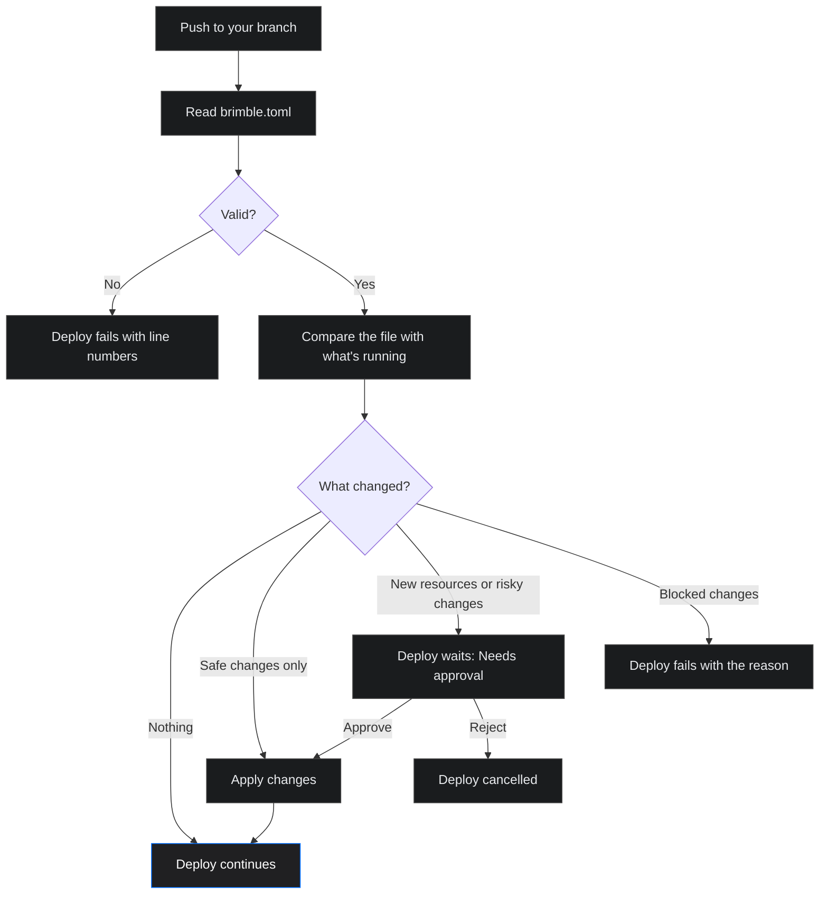

`brimble.toml` is a file in your repository that describes how your project runs: build and start commands, compute, scaling, volumes, environment variables, networking, domains, alerts, databases, buckets, and environments. When you push, Brimble compares the file with what's running and applies the difference.

Safe changes apply on their own. New resources and risky changes wait for you to approve them in the dashboard, and changes that can't be made safely stop the deploy with a clear reason.

## Quickstart

1. In the dashboard, open your project, go to **Configuration → Config as code**, and click **Generate brimble.toml**. Brimble writes a file from your project's current settings. Environment variable values are left out, so nothing secret ends up in your repository.
2. Download it, commit it at the root of your repository (or inside your project's root directory), and push.
3. The next deploy reads the file. Because it matches what's already running, nothing changes.
4. Edit the file and push again. Your changes apply as part of that deploy.

A minimal file for a web service:

```toml
#:schema https://brimble.io/schema/brimble.json

[services.api]
type = "web"
region = "eu-central"

[services.api.build]
install = "pnpm install --frozen-lockfile"
command = "pnpm build"

[services.api.deploy]
start = "node dist/server.js"
port = 3000
health = "/healthz"

[services.api.resources]
cpu = 0.5
memory = "1gb"

[services.api.env]
NODE_ENV = "production"
```

Every field is optional. Anything you leave out stays as it is in the dashboard. For every field and its format, see the [brimble.toml reference](/config-as-code/reference).

<Tip>
  Keep the `#:schema` line at the top. Editors with a TOML extension that supports JSON Schema (for example Even Better TOML in VS Code) use it for autocomplete and inline validation.
</Tip>

## Where Brimble looks for the file

On each push, Brimble reads `brimble.toml` at the pushed commit, in this order:

1. Your project's **root directory** (set under **Configuration → General**), for example `apps/api/brimble.toml`.
2. The **repository root**.

The first file found is used. If there's no file, the deploy runs exactly as it does today.

## What happens when you push



Each change in the file falls into one of four groups.

| Group | What happens | Examples |
|---|---|---|
| **Applies automatically** | Applied before the build, then the deploy continues. | Build and start commands, CPU and memory, scaling, cron, environment variables, health check path, networking headers, cache and firewall settings, rate limits, redirects, alerts, log drain subscriptions, config files, database allowed IPs and backups, bucket CORS and lifecycle rules, database connection pool settings |
| **Needs approval: creates** | The deploy waits until you approve. | A new service, database, or bucket. Attaching a new domain. |
| **Needs approval: risky** | The deploy waits until you approve. | Changing a service's region, growing a volume or database disk, turning on TLS or PgBouncer for a database, changing a service's type |
| **Blocked** | The deploy fails and the log explains why. | Shrinking a volume or disk, swapping the attached volume, changing region while a volume is attached, changing a database's engine, version, region, or high availability, turning TLS or PgBouncer off, changing a bucket's region, using a feature your plan doesn't include, a required secret that isn't set |

Resources that exist in the dashboard but aren't in the file are **never deleted**. The review screen lists them under **Not in brimble.toml** so you can see them.

### Approving changes

When a deploy needs approval, its status in **Deployment history** is **Needs approval** with a **Review config as code** link. The review screen lives at **Configuration → Config as code** and shows:

- Each resource grouped by what will happen (blocked, creates, needs approval, applies automatically), with a field-by-field before and after.
- The file and commit the plan came from.

Click the **✓** (Approve and apply) to make the changes. Brimble applies them (a new database is ready before your services link to it) and then resumes the paused deploy. Click the **✕** (Reject) to cancel the deploy without changing anything.

If the project changed after the plan was created, for example someone edited a setting in the dashboard, approving shows the updated plan and asks you to approve again.

<Frame caption="A plan under Configuration → Config as code, grouped by what happens to each resource.">
  
</Frame>

### When the file is invalid

A file with a TOML syntax error, an unknown field, or a value out of range fails the deploy. The deploy log lists each problem with its line number, for example:

```text
brimble.toml is invalid:
services.api.resources.cpu:12: Number must be less than or equal to 8
```

Fix the file and push again. If Brimble can't reach your Git provider to read the file, it logs a warning and deploys with your current settings.

## Settings managed by the file

Once a field is set in `brimble.toml`, the dashboard shows it as read-only with a **Managed by config as code** badge, so a dashboard edit can't silently drift from the file. To change the value, edit the file and push. Fields you don't set in the file stay editable in the dashboard.

## Environment variables and secrets

Values under `[services.<name>.env]` are written to your project's environment variables on each push. They're stored in your repository, so **never put secret values in the file**.

For secrets, set the value in the dashboard and list the name under `secrets.required`. The deploy is blocked until every required secret exists:

```toml
[services.api.secrets]
required = ["STRIPE_SECRET_KEY", "SESSION_SECRET"]
```

Variables you set only in the dashboard are left alone.

### Connecting databases and buckets

Use the same [references](/environments/env-references) you use in the dashboard. Referencing a database or bucket that's defined in the file also links it to the service:

```toml
[databases.db]
engine = "postgresql"
version = "17"

[buckets.uploads]
public = false

[services.api.env]
DATABASE_URL = "{{@db.PRIVATE_CONNECTION_STRING}}"
S3_BUCKET = "{{@bucket:uploads.AWS_S3_BUCKET}}"
API_HOST = "{{shared.API_HOST}}"
```

## Multiple services in one repository

A file can describe several services. The key after `services.` is the project name:

```toml
[services.web]
type = "static"
root = "apps/web"

[services.api]
type = "web"
root = "apps/api"
```

- If the file has **one service**, it applies to the project it's deployed from, even if the key doesn't match the project name.
- If it has **several**, each service's settings apply when that service deploys. A service in the file that doesn't exist yet is created from the same repository, after you approve it.

## Environments

Use `[environments.<name>]` to override settings for a workspace [environment](/environments/overview) such as staging. Overrides are merged on top of the top-level settings when a project in that environment deploys:

```toml
[environments.staging]
inherit_from = "production"

[environments.staging.services.api]
resources = { cpu = 0.2, memory = "512mb" }
scale = { min = 1, max = 1 }
env = { LOG_LEVEL = "debug" }

[environments.staging.databases.db]
disk = "10gb"
```

An environment that doesn't exist in your workspace is created on the next push. `inherit_from` must lead back to `production`.

## Pull request previews

`[environments.preview]` applies to every pull request preview of your services. It accepts `build`, `deploy`, and `env` only:

```toml
[environments.preview.services.api]
env = { LOG_LEVEL = "debug", FEATURE_FLAGS = "all" }
deploy = { start = "node dist/server.js --preview" }
```

- Preview deploys never create resources or change your production settings.
- `env` values here are preview-only. They override production values for previews and don't touch production.

## Generate or preview a file from the dashboard

**Configuration → Config as code** has two actions:

- **Generate brimble.toml** writes a file from your project's current settings, with syntax highlighting, copy, and download. Environment variable values are never included. Committing it unchanged produces no changes on the next push.
- **Preview a file** lets you paste a `brimble.toml` and see what it would change before you commit it. The file is checked as you type, and **Create plan** stays disabled until it's valid. Nothing changes until you approve the plan.

## What the file can't do

Some actions stay in the dashboard on purpose: deleting resources, restoring backups, running a backup now, rotating database passwords, managing database users, buying domains, dedicated outbound IPs, password protection, turning TLS or PgBouncer off, and converting a database to or from high availability.

## Troubleshooting

**Deploy fails with "brimble.toml is invalid".** The log lists each problem with the field path and line. The most common causes are sizes without a unit (write `memory = "1gb"`, not `memory = 1`) and durations without a unit (write `"5m"`, not `300`).

**Deploy fails with "Required secret X is not set".** Add the variable under **Environment** in the dashboard, then redeploy.

**Deploy fails with "This feature is not available on the current plan".** The file uses a feature your plan doesn't include, for example autoscaling or custom domains. Remove it from the file or upgrade your plan.

**A field is read-only in the dashboard.** It's set in `brimble.toml`. Change it in the file and push, or remove it from the file to manage it in the dashboard again.

**A dashboard-only resource shows under "Not in brimble.toml".** That's expected. Brimble never deletes resources that aren't in the file.

## Next steps

- [brimble.toml reference](/config-as-code/reference), every field and its format.
- [Environment variables](/environments/environment-variables) and [references](/environments/env-references).
- [Environments](/environments/overview).
