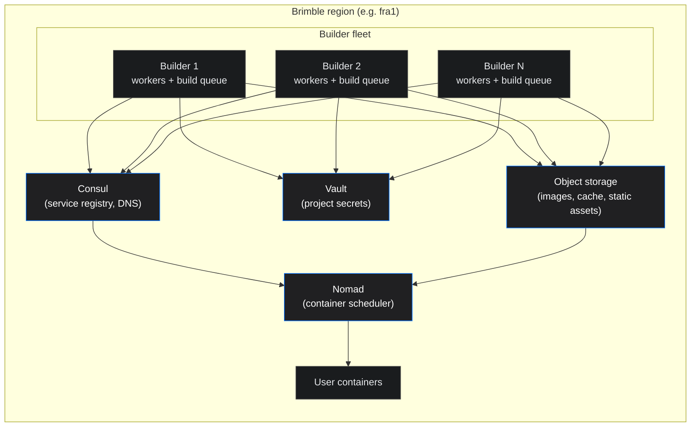

A deep dive into how a `git push` becomes a running container on Brimble. This page is for the curious: developers who want to understand the system they're trusting their workloads to, and engineers who want a frank look at the design decisions behind a platform built on bare metal.

If you're looking for the user-facing documentation of build phases, environment variables, and configuration, see [Builds](/projects/builds). This is the architecture post.

## Inside the builder

Every Brimble build runs inside a process we call **the Builder**. There's nothing clever about the name, it's the binary that takes a build request and produces a deployable artifact. We run a fleet of them across our regions, and each is responsible for the full lifecycle of a build: clone, detect, install, build, push, and hand the artifact off to the orchestrator.

The Builder is a single TypeScript service exposing both an HTTP API and a streaming gRPC interface. Internally, it's split into a small set of cooperating components:

- **Event processor.** Subscribes to a RabbitMQ queue and a Redis pub/sub channel for build, clone, and lifecycle events.
- **Worker pool.** A bounded set of OS-level workers, each with a fixed slot count for concurrent jobs. Builds wait in a Bull (Redis-backed) queue when slots are full; we don't drop work.
- **Build executors.** Per-language scripts called by the worker that own the actual build, BuildKit for Docker, Railpack for backend languages, our own static builder for frontends.
- **Orchestration queue.** A separate per-project Bull queue that ferries the finished artifact into Nomad. We deliberately serialize per-project (concurrency = 1 per project) so two deploys of the same project never race.
- **Cache uploader.** Streams completed BuildKit layers to object storage in the background while the build is still running.

Three external systems sit underneath:

- **Nomad** schedules the resulting container onto a host in the project's region.
- **Consul** is the service registry and DNS plane — the Builder registers itself and its dependencies (including a sidecar Redis used for queue state) with Consul, and the proxy resolves projects by name through Consul DNS.
- **Vault** holds every project secret. Plaintext never lands on the Builder's disk; the Builder reads each project's secrets at build time with a short-lived token and pipes them into BuildKit through the `--secret` mount.

## How the pieces fit together

A live region looks like this:

Two things to call out about this picture:

**The Builder doesn't share state with other Builders directly.** Each one owns its own worker pool and its own attached Redis for queue state. The only "fleet-wide" things it talks to are Consul, Vault, Nomad, and the shared object-storage bucket. That keeps the blast radius of a single Builder failing small: Nomad reschedules it, the orchestration layer notices, and your next build gets routed to a healthy Builder.

**The dispatcher always picks a Builder in your project's region.** When a deploy request comes in, the regional dispatcher filters live Builders by `(region, healthy)` and scores the survivors by available memory and current load. The lowest-scored healthy Builder picks up the job. Source code, the layer cache, and the destination host all stay in the same region, no cross-region round-trips during the build.

## Life of a build

Walking through one deploy from `git push` to "live":

### 1. Webhook in, queue out

Your Git provider (GitHub, GitLab, or Bitbucket) sends a push webhook to Brimble. The platform validates the payload, finds the matching project, and creates a `deployment` record. It then asks the regional dispatcher for a Builder and emits a build event onto the message bus.

The whole thing takes milliseconds. By the time the dashboard's deployment row appears with status `pending`, the event is already on its way to a Builder.

### 2. The Builder accepts the job

The chosen Builder's event processor pulls the message off the bus and pushes a job onto its local Bull queue. A free worker pool slot picks it up. If every slot is busy, the job waits, your deployment shows `pending` until a slot frees.

### 3. Clone

The Builder hits the Git provider with the credentials it pulled from Vault for this user, fetches a shallow clone of just the target commit, and writes the working tree to a per-job directory. Submodules clone recursively. The clone is depth-1 by default; we don't pull history we don't need.

If the repo is private and the credentials have expired (a common case after rotating a GitHub PAT), the clone fails fast and the job is marked failed with a clear message. We don't retry into a wall.

### 4. Detect and inject secrets

The Builder inspects the working tree to decide which build path to take:

- A `Dockerfile` at the project root means BuildKit takes over.
- A static-site or frontend framework (Vite, Astro, Next.js export, SvelteKit static, and friends) routes to **Brimble's frontend builder**, our own static builder.
- Anything else (Node, Python, Ruby, Go, Java, PHP, Rust, Elixir) runs through **Railpack**, the upstream tool from Railway, with our own image cache.

Once the builder is chosen, the Builder reads your project's environment variables from Vault and prepares them for injection. Secrets travel through BuildKit's `--secret` mount or as Railpack `--secret` arguments, never as plain `--build-arg`, so they don't get baked into image layers and they don't show up in `docker history`.

### 5. Install and build

The build itself runs in an isolated container on the Builder host. In production, that container is sandboxed with **gVisor** so a malicious or buggy build can't touch the Builder's filesystem or network. Resource limits are applied per build (CPU, memory, ephemeral disk), and outbound network access is allowed for fetching dependencies but constrained at the host level.

The cache is the part that makes warm builds fast:

- **Layer cache for Docker and Railpack.** Layers are content-addressed and stored in regional object storage. BuildKit's S3 cache backend is wired to that bucket, with `mode=min`, `compression=zstd`, and parallelized uploads. Subsequent builds pull cached layers directly from object storage rather than rebuilding them.
- **Install output cache for backend builds.** `node_modules`, `~/.cache/pip`, `vendor/bundle`, `~/.cargo`, the language-specific install paths, are cached separately, keyed on the lockfile.
- **Pre-warmed Railpack base images.** Each Builder pulls the Railpack base images on a cron and keeps them locally. The "Detect" phase doesn't pay for a cold image pull.

If the cache is cold (15+ days idle, or a manual cache clear), the build runs from scratch and warms the cache as it goes. Once warm, a typical Node, Python, or Go build clears Install + Build in seconds rather than minutes.

### 6. Push

For container builds, the Builder pushes the finished image to our internal registry. Layers that already exist there from a prior build aren't re-uploaded, BuildKit deduplicates by content hash. For static sites, the build output is uploaded to the globally distributed object storage that fronts our edge; no container is produced.

### 7. Launch

This is where the project goes live on the Nomad cluster. Container artifacts move into a per-project orchestration queue, processed one at a time per project (concurrency = 1) so two simultaneous deploys of the same project don't race for the same slot. The orchestration worker:

- Builds a Nomad job spec from the project's configuration (CPU, memory, persistent volume, environment, health check, regional affinity).
- Submits the spec to Nomad's API over mTLS.
- Watches Nomad's allocation events for the new deployment.
- If a pre-start command is configured, Nomad runs it first as a sidecar lifecycle task; the main task only starts after pre-start exits cleanly.

Once Nomad reports the allocation healthy and Consul's health check passes, the proxy flips traffic to the new deployment. The previous deployment drains and stops.

For static sites, there's no orchestration step. The upload to object storage is the deploy. The proxy reads the latest active version directly from object storage, requests bypass any container layer entirely.

### 8. Cleanup

The job slot is freed back to the worker pool. The clone directory is removed. Cache uploads that were running in the background continue. The deployment record's status flips to `active` and the dashboard updates.

Total wall clock from `git push` to a live URL on a warm cache, typically under a minute for a small Node service, a couple of minutes for a Next.js or Rails app. Cold builds are slower but predictably so: you pay the dependency-install cost once and reuse it after.

## The decisions behind the architecture

Three calls we made deliberately:

**Long-lived Builders, autoscaled by demand, not per-build microVMs.** A common alternative is to spin up a fresh microVM (Firecracker, Cloud Hypervisor, or similar) for every single build, paying boot cost on each one in exchange for hard isolation. We took the other route: gVisor-sandboxed containers on long-lived Builders. **Multiple Builders run on each host**, and the regional fleet itself autoscales, when build demand rises, we add Builder instances; when it falls, we drain and remove them. That trades a small amount of isolation strength for a meaningful reduction in cold-start latency and operational complexity. We don't pay for idle microVMs, and we don't pay for whole idle hosts either, capacity tracks demand. Builds that need stronger isolation (Pro and Team plans, sensitive workloads) can be carved out per-customer.

**Per-project orchestration queue.** It would be tempting to dispatch every Nomad submission through a single global queue and serve them all at once. We don't. Each project gets its own orchestration queue with concurrency = 1 because deploy ordering matters: a fast deploy and a slow deploy of the same project, processed concurrently, can resolve in the wrong order and leave the project on an old commit. Per-project serialization sidesteps the problem at the cost of a few hundred lightweight Bull queues sitting idle.

**Region-pinned everything.** A build, its artifact, its cache, and its destination host all live in the same region. We had to make this choice at the Builder-dispatch layer, the cache-storage layer, and the orchestration layer. The reward is that push and pull phases of a build don't pay a 50–200ms cross-region round-trip per layer. Cross-region calls between Brimble's own services exist, but they're explicit, not accidental.

## What changed for users

Concretely, what the architecture above buys you:

- **Builds run in your project's region.** No "the build is in us-east, the project is in eu-west, the cache is in ap-south" surprise. If you switch a project's region, the next build runs in the new region automatically.
- **Warm-cache builds finish in a fraction of cold-build time.** The same Node lockfile producing the same `node_modules`? You don't pay for that work twice. BuildKit's layer cache and the install-output cache survive between builds, in object storage, so any Builder in the region can pull them.
- **Secrets are encrypted at rest, scoped per project, and stay out of image layers.** Vault is the source of truth, BuildKit's `--secret` mount enforces the no-leak property, and `docker history` on your image won't show your `DATABASE_URL`.
- **Static sites have no idle compute.** They're files served from a globally distributed object store fronted by Cloudflare. The "container" model never applies.
- **Failed builds fail fast.** The Builder doesn't sit on a stuck step waiting for a network timeout to expire. The deploy phase is bounded; if a step exceeds its budget, the job is killed and the dashboard shows the cause.

## Build with Brimble

If you've made it this far, you're the kind of developer we're building for. The shortest path from here to a deploy is the [Quickstart](../getting-started/quickstart). If you'd rather understand the configurable surface first, the user-facing [Builds](/projects/builds) doc covers commands, caching, build minutes, and the things you'd actually tweak.

If you're an infra-curious reader who wants to know what runs underneath the rest of the platform, [Internal networking](../networking/internal-services) covers the WireGuard mesh, Consul service discovery, and Consul Intentions for service-to-service auth.
