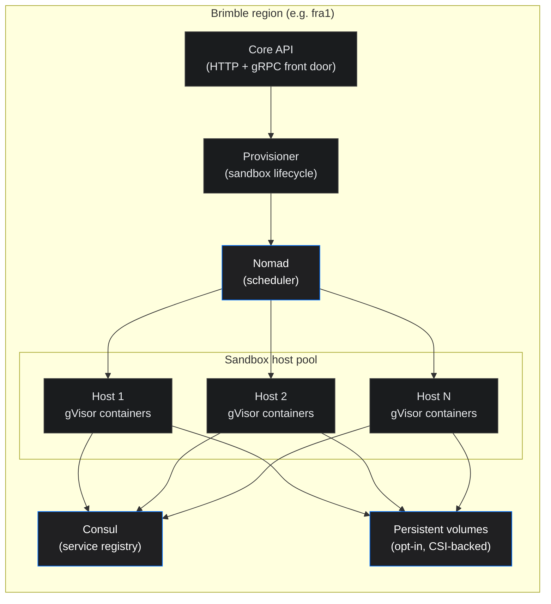

A deep dive into how a sandbox request becomes a running, isolated container on Brimble. This page is for the curious: developers who want to understand the isolation guarantees they're trusting, and engineers who want a frank look at the design decisions behind running short-lived user workloads on shared infrastructure.

If you're looking for the user-facing documentation of sandbox lifecycle and operations, see [Sandboxes](overview). This is the architecture post.

## Inside the sandbox runtime

A sandbox is one running container per user request, scheduled by Nomad and isolated by gVisor on a dedicated pool of hosts. Three components cooperate to put it there and keep it healthy.

- **Core API.** The HTTP and gRPC front door. Validates the create request (region, plan, spending limits, specs, persistence shape) and hands the provisioning work to the provisioner.
- **The provisioner.** A Brimble service that owns non-build workloads (databases, sandboxes). Resolves the requested template to a container image, schedules the sandbox as a Nomad job, and waits for the container to come up.
- **Sandbox host pool.** A dedicated set of Nomad client nodes reserved for sandboxes. They're separate from the hosts your projects run on, so a runaway sandbox can't starve a production service.

Two cross-cutting systems hold this together:

- **Nomad** schedules the container onto a host in the requested region, manages the allocation, scales it to zero on pause, and back to one on resume.
- **Consul** is the service registry: every sandbox is registered for service discovery, with metadata labels for owner identification.

## How the pieces fit together

Two things worth calling out:

**Sandboxes have their own host pool.** They share Nomad and Consul with the rest of Brimble, but the hosts that actually run sandbox containers are pinned to the sandbox pool. That separation matters for two reasons: a heavy sandbox can't crowd out a customer's web service, and a sandbox compromise's blast radius stops at the pool boundary.

**Create blocks until the sandbox is ready.** `POST /sandboxes` waits for Nomad to schedule the container (~2–3s typical) and returns `status: "ready"`. The SDK's `create()` mirrors that — no separate wait step. Use `getReady()` when picking up an existing sandbox after a process restart or resume.

## Life of a sandbox

Walking through one sandbox from request to destroy.

### 1. Create request

The create request (SDK call, dashboard form, or raw API hit) arrives with a template, optional region, optional specs, and optional persistence flags. Brimble validates it synchronously:

- The template exists.
- The region is allowed for the caller's plan (free-plan accounts can't pick paid regions).
- The workspace's spending limit isn't exceeded.
- The caller isn't past their per-plan sandbox concurrency cap.
- If `fromSnapshot` is set, the snapshot belongs to the caller and is `ready`.

Any check failing returns a clear error. Otherwise Brimble provisions the container synchronously and the response returns with `status: "ready"` and the sandbox ID (~2–3s typical).

### 2. Provisioning

The provisioner runs inline on the create request:

- Resolves the template (or the snapshot's image, if restoring) to a concrete container image.
- Schedules a Nomad job in the sandbox host pool with the requested specs, network mode, and optional persistent volume.
- Waits for the container to come up. If it doesn't reach running state within a few minutes, the sandbox is cleaned up and marked `failed`.

### 3. Container starts under sandboxed runtime

Each sandbox container runs under **gVisor** in production, a user-space kernel that intercepts syscalls and reimplements them in a memory-safe Go process. Practical security wins:

- Syscalls go through gVisor before they reach the host kernel.
- Linux capabilities are stripped on the container.
- `no-new-privileges` is set, blocking setuid escalation.
- A hard process-count cap prevents fork bombs.
- The container can't reach the underlying host's identity or credentials surface.

The container's network mode depends on the sandbox's egress config:

- **`open`** (default), normal outbound network via bridge mode.
- **`deny_all`**, outbound traffic blocked by a dedicated no-egress network profile.
- **`restricted`**, default deny with an allowlist enforced at the host firewall for the container's address.

You can set egress at create time or update it later; changing between profiles may switch the Nomad network mode and takes a few seconds to apply. The legacy `blockOutbound: true` flag maps to `deny_all`.

### 4. Storage attaches (if requested)

- **Ephemeral sandboxes** get a scratch disk sized by the `specs.disk` value (GB). It's cleaned up when the allocation goes away.
- **Persistent sandboxes** (created with `persistent: true` or `volumeId`) get a CSI-backed volume mounted at the sandbox's workspace directory. Single-writer attachment, sized at create time.

The volume's lifecycle is independent of the sandbox: pausing scales the container down but keeps the volume attached; destroying detaches the volume but doesn't delete it. The user can attach the same volume to a future sandbox by passing its `volumeId`.

### 5. Sandbox goes ready

Once the container is up, the sandbox flips to `ready` and the API starts accepting runtime operations: `exec`, `code`, file read/write, pause, snapshot.

### 6. Operations run

- **`exec` / `code`** run a command or snippet inside the container and return stdout/stderr. Pass `stream: true` to receive output as Server-Sent Events (`text/event-stream`) as it is produced instead of waiting for the command to finish.
- **File operations** stream bytes in and out. A per-file size cap keeps a bad call from filling the host.
- **`pause`** stops the container, releasing CPU and memory. The persistent volume (if any) stays attached.
- **`resume`** starts a fresh container and reattaches the same volume.

Pause and resume produce different container instances. Anything written to ephemeral disk between the previous start and the pause is gone on resume; anything on a persistent volume survives.

### 7. Destroy

Manual destroy, auto-destroy timeout, max-lifetime, oneShot-exit, or stuck-starting cleanup, any of these end the same way: the container is stopped, the persistent volume (if any) is detached but not deleted, and the sandbox's status becomes `destroyed`.

## The decisions behind the architecture

A few calls we made deliberately.

**gVisor instead of microVMs.** A common alternative for multi-tenant user code is to spin up a fresh microVM (Firecracker, Cloud Hypervisor, or similar) per workload, paying boot cost on each one in exchange for hardware-level isolation. We use gVisor on long-lived hosts instead. Cold-start latency drops from seconds to a few hundred milliseconds, the operational surface stays small, and the syscall-level isolation is strong enough for the workloads sandboxes target. Workloads with stricter isolation requirements (regulated industries, customer-isolated multi-tenancy) can be carved out per-customer; the platform supports it but isn't the default.

**Dedicated sandbox host pool.** We could pack sandboxes onto the same hosts as projects, get higher utilization, save money. We don't. Sandboxes are user-controlled, often run unfamiliar code, and have very different load profiles than long-running web services (burst-y, short, high CPU). Keeping them on their own hosts means a noisy sandbox can't degrade a customer's production service, and a sandbox-side incident has a clean operational boundary.

**No auto-reschedule on host failure.** A normal Brimble project is rescheduled onto another host if its current host fails. Sandboxes aren't. If the host dies mid-sandbox, the sandbox transitions to `failed` and the user is expected to create a new one (or restore from a snapshot they took earlier). Reasoning: most sandbox state is in-memory or in ephemeral disk anyway. Migrating that automatically would resurrect stale, half-broken state on a fresh host. We'd rather fail clean and let the user decide whether to restore.

**Persistence is opt-in.** Sandboxes are ephemeral by default. You pay for storage only if you ask for it. Compare with managed databases, where persistence is the whole point and the volume is provisioned automatically. Opt-in matches the dominant sandbox use case (short-lived, throw-away work) without taking away durability for the cases that need it.

## What it means for you

Concretely, the architecture above buys you:

- **Cold starts in seconds, not minutes.** Sandboxes don't pay full microVM boot time. A typical create-to-ready window is short enough for interactive use.
- **Clean failure modes.** A failed sandbox is just a destroyed record. The platform doesn't try to be clever and resurrect anything; you create a new one or restore from a snapshot.
- **Strong syscall-level isolation by default.** You don't configure gVisor, drop capabilities yourself, or harden the runtime. The defaults are tight.
- **No surprise compute bills.** Pause scales the container to zero. Auto-destroy and max-lifetime ensure abandoned sandboxes can't run indefinitely. The spending limit hard-stops new sandbox creation before usage spirals.
- **Cross-region isolation.** A sandbox runs in the region you picked. Source code, image layers, and (if any) persistent storage all stay local to that region. Cross-region calls aren't part of the sandbox path.

## Next steps

- [Sandboxes overview](overview), the user-facing lifecycle and operations.
- [SDKs](sdks), the recommended way to drive sandboxes from code.
- [Inside the Brimble Builder](../projects/build-system), the companion deep-dive for the builds path.
